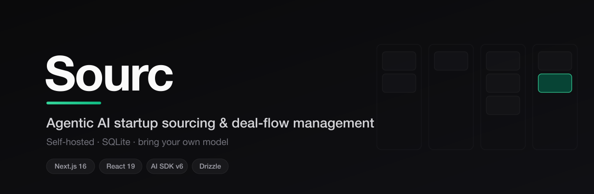

<div align="center">



# Sourc

**An open, self-hosted dashboard for AI-assisted startup sourcing and deal-flow management.**

Bring your own model. Bring your own data. Run it locally in two minutes.


</div>

---

## What it is

Sourc is a CRM-style pipeline for sourcing early-stage startups: import companies from
multiple sources, score them across structured dimensions, track outreach and calls, and
generate presentation-ready briefs and outreach emails with the LLM of your choice.

It runs entirely on your machine against a local SQLite database — no accounts, no SaaS,
no vendor lock-in. **The AI layer is provider-agnostic**: plug in OpenAI, Groq, OpenRouter,
DeepSeek, a local Ollama model, or anything else that speaks the OpenAI chat-completions API.

## Features

- **Pipeline** — Kanban-style deal flow across 11 stages (New → Selected / Hell No / Already Sourced).
- **Startup CRM** — full records with 10 scoring dimensions, founders, outreach events, and call notes.
- **AI briefs** — turn a startup record into a polished, VC-standard sourcing brief (streamed).
- **AI outreach** — draft and refine founder emails in a consistent voice (streamed).
- **Imports** — load startups from accelerator lists, the Italian Registro Startup Innovative, Firecrawl scrapes, or a custom JSON queue.

## Tech stack

| Layer     | Choice |
|-----------|--------|
| Framework | Next.js 16 (App Router) + React 19 |
| Database  | SQLite via `better-sqlite3` + Drizzle ORM |
| AI        | Vercel AI SDK v6 — any OpenAI-compatible provider |
| UI        | Tailwind v4 + shadcn/ui |

## Quick start

```bash
git clone <your-fork-url> sourc && cd sourc
npm install
cp .env.example .env.local      # then fill in your AI provider (see below)
npm run db:migrate              # creates a fresh, empty data/sourcing.db
npm run dev
```

Open [http://localhost:3000](http://localhost:3000). The database starts **empty** — add
startups manually or via the import tools on the `/sources` page.

## Configuring the AI provider

Sourc talks to any **OpenAI-compatible** chat-completions endpoint. Set three variables in
`.env.local` — that's the only AI configuration:

```bash
AI_BASE_URL=https://api.openai.com/v1   # your provider's base URL
AI_API_KEY=sk-...                        # your key
AI_MODEL=gpt-4o-mini                     # any model the provider serves
```

Common providers (see `.env.example` for the full list):

| Provider   | `AI_BASE_URL`                         | Example `AI_MODEL`            |
|------------|---------------------------------------|-------------------------------|
| OpenAI     | `https://api.openai.com/v1`           | `gpt-4o-mini`                 |
| OpenRouter | `https://openrouter.ai/api/v1`        | `openai/gpt-4o`               |
| Groq       | `https://api.groq.com/openai/v1`      | `llama-3.3-70b-versatile`     |
| DeepSeek   | `https://api.deepseek.com/v1`         | `deepseek-chat`               |
| Ollama     | `http://localhost:11434/v1`           | `llama3.1` (any key value)    |

If these aren't set, the app still runs — the AI brief/email endpoints just return a clear
"AI not configured" message until you add them.

## Database

```bash
npm run db:generate   # generate a migration after editing lib/db/schema.ts
npm run db:migrate    # apply migrations
npm run db:studio     # open Drizzle Studio to browse data
```

The database file (`data/*.db`) is git-ignored — your data never leaves your machine and is
never committed.

## Project structure

```
app/            Next.js routes — pages + API endpoints (briefs, emails, imports)
lib/ai.ts       Provider-agnostic model resolver (the only AI config point)
lib/db/         Drizzle schema, migrations, and queries
lib/actions/    Server actions (startups, outreach, briefs, sources, ...)
components/     UI (shadcn/ui + Tailwind)
```
